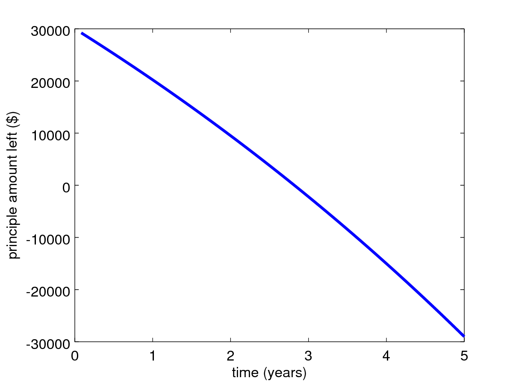

# Introduction to Nonlinear Problems

This repository [lecture notes](./Intro_to_nonlinear_problems.ipynb) provides a nonlinear
function [loan_payments.m](./loan_payments.m) to attempt to solve for a given variable. 



function `loan_payments`

```matlab
function amount_left = loan_payments(monthly_payment,price,apr,no_of_years,plot_bool)
  % loan_payments(monthly_payment,price,apr,no_of_years) calculates the principal amount
  % left over on a loan if 
  % the monthly payment is "monthly_payment"
  % the price of the loan is "price"
  % the annual percent rate of interest is "apr" (compounded monthly)
  % and the number of years the loan is paid is "no_of_years"
  % plot_bool=0,1 if the principle left should be plotted no,yes
  interest_per_month = apr/12;
  number_of_months = no_of_years*12;
  principle=price;
  P_vector=zeros(1,number_of_months);
  for i = 1:number_of_months
    principle=principle-monthly_payment;
    principle=(1+interest_per_month)*principle;
    P_vector(i)=principle;
  end
  amount_left=principle;
  if plot_bool
    plot([1:number_of_months]/12, P_vector)
    xlabel('time (years)')
    ylabel('principle amount left ($)')
  end
end
```
